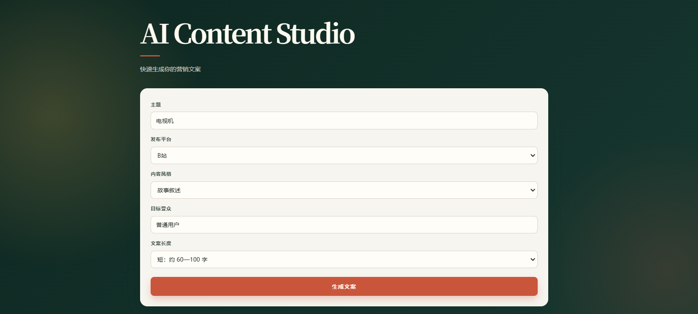
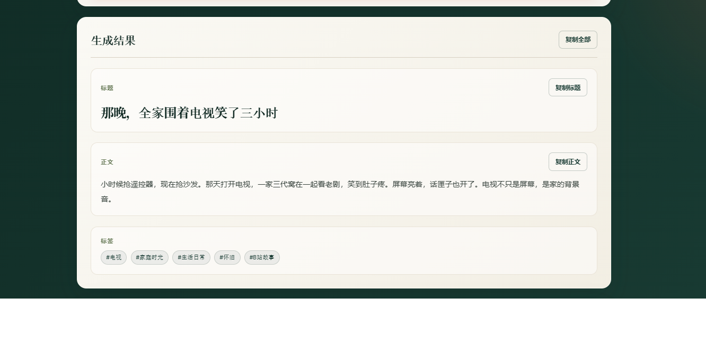
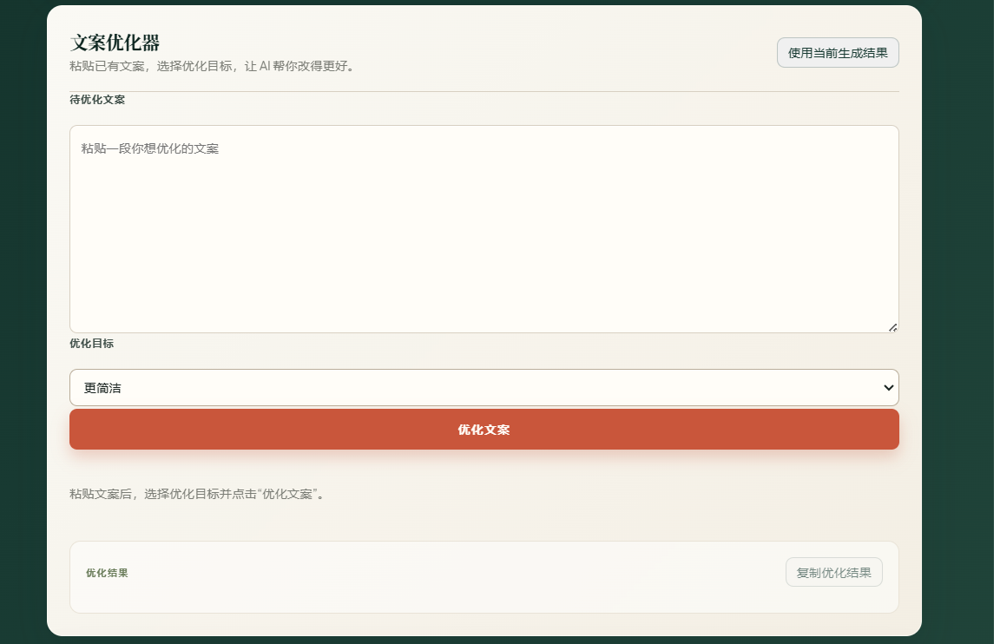
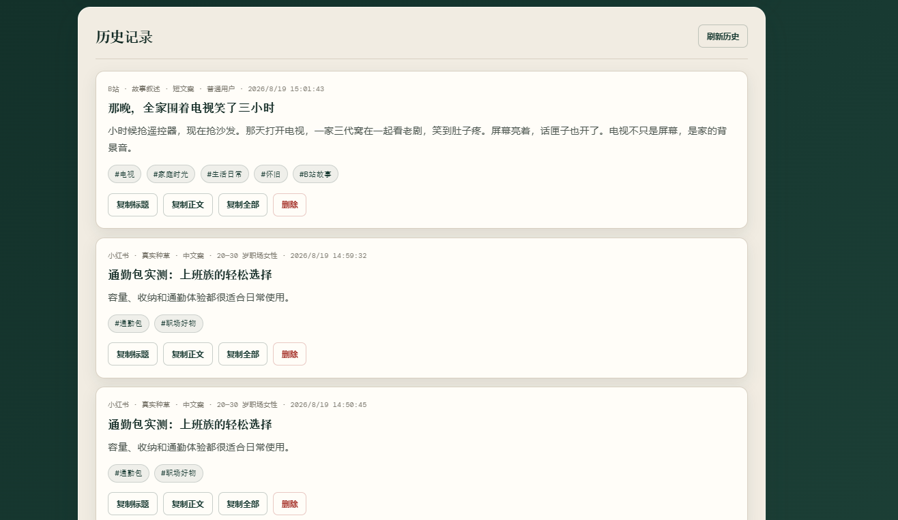
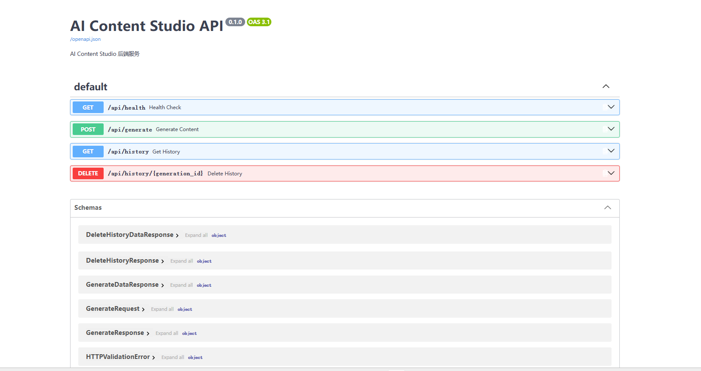

# AI Content Studio

> 面向中文社交媒体创作者的全栈 AI 内容工作台。支持文案生成、目标化优化、历史沉淀，以及正在开发中的内容项目与多版本管理。

AI Content Studio 帮助内容创作者将一个主题快速转化为适合不同平台的中文文案，并提供从生成、优化、复制到内容管理的连续工作流。

项目采用前后端分离架构：Web 前端部署在 Vercel，FastAPI 后端部署在 Render，AI 能力由 DeepSeek API 提供。

## 在线体验

- Web 网页端：[AI Content Studio](https://ai-content-studio-ecru.vercel.app/)
- API 文档：[FastAPI Swagger UI](https://ai-content-studio-vp7l.onrender.com/docs)
- API 健康检查：[Health Check](https://ai-content-studio-vp7l.onrender.com/api/health)

> Render 免费实例在一段时间无访问后可能休眠；首次请求可能需要等待服务唤醒。

## 核心功能

### 已完成

- 根据主题生成中文社交媒体与营销文案
- 支持平台、文案风格、目标受众和篇幅设置
- 结构化返回标题、正文、标签和完整文案
- 文案优化器：支持“更简洁”“更有吸引力”“更专业”“更适合小红书”等优化目标
- 一键将当前生成结果带入优化器
- 一键复制标题、正文、完整文案与优化结果
- SQLite 本地持久化生成历史
- 历史记录查看、分页读取与删除确认
- 内容项目创建、项目列表与项目详情 API
- 内容版本数据库模型：支持初稿、优化稿与手动编辑稿
- 请求参数校验、AI 服务异常处理和数据库异常处理
- FastAPI Swagger 交互式接口文档
- Web 前端部署至 Vercel
- FastAPI 后端部署至 Render
- 微信小程序基础客户端与真机调试

### 正在开发

- 将生成结果和优化结果自动保存为内容项目版本
- 项目内版本列表与版本详情
- 将指定版本设为最终稿
- 前端内容项目列表与项目详情视图
- 原稿与优化稿的并排比较
- 品牌语气库与一稿多发
- AI 发布前文案检查与 Markdown/TXT 导出

## 技术栈

| 模块 | 技术 |
|---|---|
| 后端 | Python、FastAPI、Pydantic |
| AI 服务 | DeepSeek API |
| 数据库 | SQLite |
| 网页前端 | HTML、CSS、原生 JavaScript |
| 微信小程序 | 原生微信小程序、WXML、WXSS、JavaScript |
| 自动化测试 | pytest、FastAPI TestClient |
| 部署 | Vercel、Render |
| 版本控制 | Git、GitHub |

## 产品工作流

```text
填写创作简报
    ↓
AI 生成标题、正文与标签
    ↓
复制、保存至历史记录，或带入文案优化器
    ↓
按目标生成优化版本
    ↓
保存至内容项目并管理多个版本（开发中）
    ↓
选择最终稿并发布/导出（开发中）
```

## 项目结构

```text
ai-content-studio/
├── backend/
│   ├── app/
│   │   ├── ai_service.py        # DeepSeek 调用与结果解析
│   │   ├── database.py          # SQLite 初始化与数据访问层
│   │   ├── main.py              # FastAPI 路由与 Pydantic 模型
│   │   ├── prompts.py           # 文案生成与优化 Prompt
│   │   └── ...
│   ├── data/
│   │   └── ai_content_studio.db # 本地 SQLite 数据库（不提交）
│   ├── tests/
│   │   ├── test_generate.py
│   │   ├── test_optimize.py
│   │   ├── test_history.py
│   │   └── ...
│   ├── .env.example
│   └── requirements.txt
├── frontend-web/
│   ├── index.html               # Web 页面结构
│   ├── app.js                   # 页面交互、API 请求与渲染
│   └── style.css                # 设计系统与响应式样式
├── miniprogram/
│   ├── pages/
│   │   ├── index/               # 文案生成页面
│   │   └── history/             # 历史记录页面
│   ├── utils/
│   │   ├── config.js            # API 地址配置
│   │   └── request.js           # 请求封装
│   ├── app.js
│   ├── app.json
│   └── app.wxss
├── docs/
│   └── v0.4-plan.md             # 内容项目与版本管理规划
├── screenshots/
├── CHANGELOG.md
├── LICENSE
└── README.md
```

## API 概览

| 方法 | 路径 | 说明 | 状态 |
|---|---|---|---|
| `GET` | `/api/health` | 后端健康检查 | 已完成 |
| `POST` | `/api/generate` | 生成并保存 AI 文案 | 已完成 |
| `POST` | `/api/optimize` | 按目标优化已有文案 | 已完成 |
| `GET` | `/api/history` | 获取生成历史，支持分页 | 已完成 |
| `DELETE` | `/api/history/{generation_id}` | 删除单条历史记录 | 已完成 |
| `POST` | `/api/projects` | 创建内容项目 | 已完成 |
| `GET` | `/api/projects` | 获取内容项目列表 | 已完成 |
| `GET` | `/api/projects/{project_id}` | 获取单个项目详情 | 已完成 |
| `POST` | `/api/projects/{project_id}/versions` | 向项目创建文案版本 | 已完成 |
| `GET` | `/api/projects/{project_id}/versions` | 获取项目版本列表 | 开发中 |
| `PATCH` | `/api/versions/{version_id}/final` | 将版本设为最终稿 | 开发中 |

## API 示例

### 创建内容项目

```http
POST /api/projects
Content-Type: application/json
```

```json
{
  "topic": "秋季新品茶饮推广",
  "platform": "小红书",
  "style": "自然治愈",
  "audience": "25 至 35 岁城市白领",
  "length": "medium"
}
```

### 创建项目内容版本

```http
POST /api/projects/1/versions
Content-Type: application/json
```

```json
{
  "source_type": "generated",
  "optimization_goal": null,
  "title": "秋天的第一杯茶，从一口回甘开始",
  "body": "风吹过窗边，茶香慢慢升起。",
  "hashtags": [
    "秋日饮茶",
    "小红书文案",
    "生活方式"
  ],
  "content": "秋天的第一杯茶，从一口回甘开始\n\n风吹过窗边，茶香慢慢升起。\n\n#秋日饮茶 #小红书文案 #生活方式"
}
```

### 优化已有文案

```http
POST /api/optimize
Content-Type: application/json
```

```json
{
  "content": "指尖握住笔杆，墨迹顺着思绪蜿蜒。",
  "goal": "更有吸引力"
}
```

## 本地运行

### 环境要求

- Python 3.10 或更高版本
- DeepSeek API Key
- VS Code Live Server，或任意静态网页服务器
- 可选：微信开发者工具

### 1. 配置后端环境

在项目根目录执行：

```powershell
cd backend
python -m venv .venv
.\.venv\Scripts\Activate.ps1
pip install -r requirements.txt
Copy-Item .env.example .env
```

在 `backend/.env` 中填写：

```text
DEEPSEEK_API_KEY=你的_DeepSeek_API_Key
```

> 不要提交 `.env`、API Key、密码、Token 或任何私密配置到 GitHub。

### 2. 启动 FastAPI 后端

仍在 `backend` 目录：

```powershell
uvicorn app.main:app --reload --host 0.0.0.0 --port 8000
```

打开交互式 API 文档：

```text
http://127.0.0.1:8000/docs
```

### 3. 启动 Web 网页端

使用 VS Code 的 Live Server 打开：

```text
frontend-web/index.html
```

本地前端地址通常是：

```text
http://127.0.0.1:5500
```

该地址已在 FastAPI 的 CORS 配置中允许。

### 4. 运行测试

在 `backend` 目录且虚拟环境已激活时运行：

```powershell
pytest -v
```

## 微信小程序调试

小程序端不保存 DeepSeek API Key，不包含 Prompt、AI 调用或 SQLite 逻辑；它只调用后端 API。

目前已接入：

```text
POST /api/generate
GET /api/history
DELETE /api/history/{generation_id}
```

本地调试步骤：

1. 使用微信开发者工具打开 `miniprogram` 文件夹。
2. 在后端目录启动 FastAPI：

```powershell
uvicorn app.main:app --reload --host 0.0.0.0 --port 8000
```

3. 在 Windows 终端运行：

```powershell
ipconfig
```

4. 在 `miniprogram/utils/config.js` 配置电脑当前局域网 IPv4 地址：

```js
const BASE_URL = "http://你的局域网IP:8000";

module.exports = {
  BASE_URL
};
```

5. 微信开发者工具中启用：

```text
详情 → 本地设置 → 不校验合法域名、web-view（业务域名）、TLS 版本以及 HTTPS 证书
```

6. 真机调试时，手机与电脑需要连接同一个 Wi-Fi。
7. 若手机无法连接后端，请在 Windows 防火墙中允许 TCP `8000` 入站连接。

> 局域网 IP + HTTP 仅用于本地调试。发布小程序前应配置正式 HTTPS API 域名，并在微信公众平台配置 request 合法域名。

## 项目截图

### Web 文案生成



### AI 生成结果



### 文案优化器



### 历史记录



### FastAPI Swagger 文档



## 开发路线

- [x] v0.1：FastAPI 后端、输入校验与 DeepSeek 文案生成
- [x] v0.2：SQLite 历史记录、复制、删除与分页
- [x] v0.3：文案优化器与 Web UI 统一设计
- [x] v0.3：Web 部署至 Vercel、API 部署至 Render
- [x] v0.4：内容项目创建、项目列表、项目详情 API
- [x] v0.4：内容版本数据表与创建版本 API
- [ ] v0.4：项目内版本列表、最终稿选择与 Web 项目管理界面
- [ ] v0.5：品牌语气库与多平台改写
- [ ] v0.6：AI 发布前检查、版本对比与导出
- [ ] 小程序接入文案优化器与内容项目管理

## 当前状态

**v0.4 开发中。**

项目已实现 Web 与 API 的公网部署，生成、优化与历史管理功能可在线使用；内容项目与文案多版本管理的后端基础能力正在逐步完善。

## License

本项目采用 [LICENSE](LICENSE) 中声明的许可证。